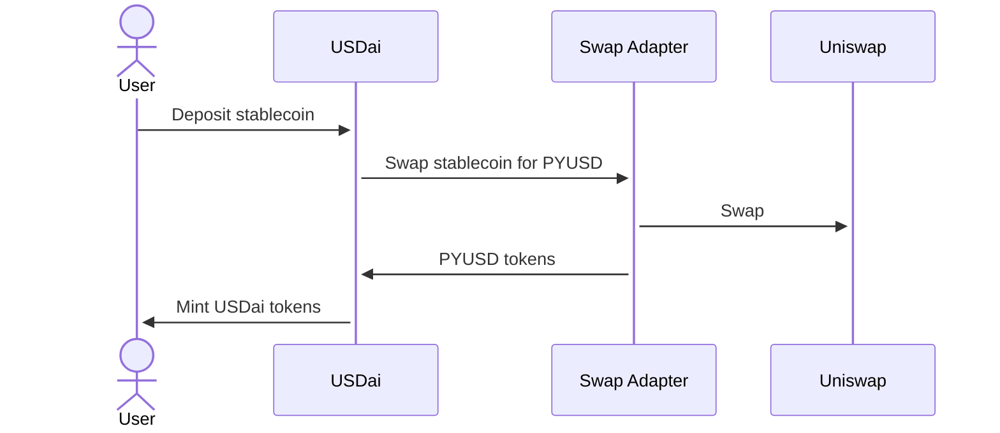
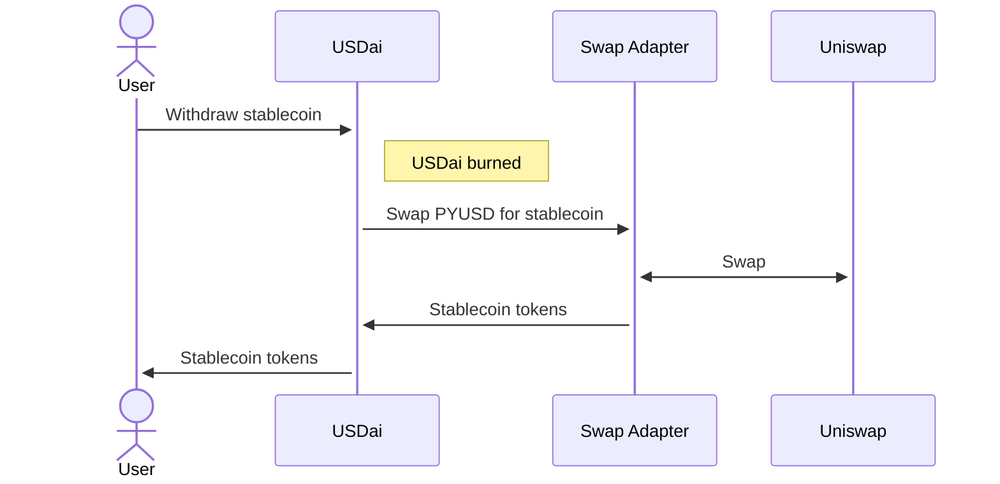
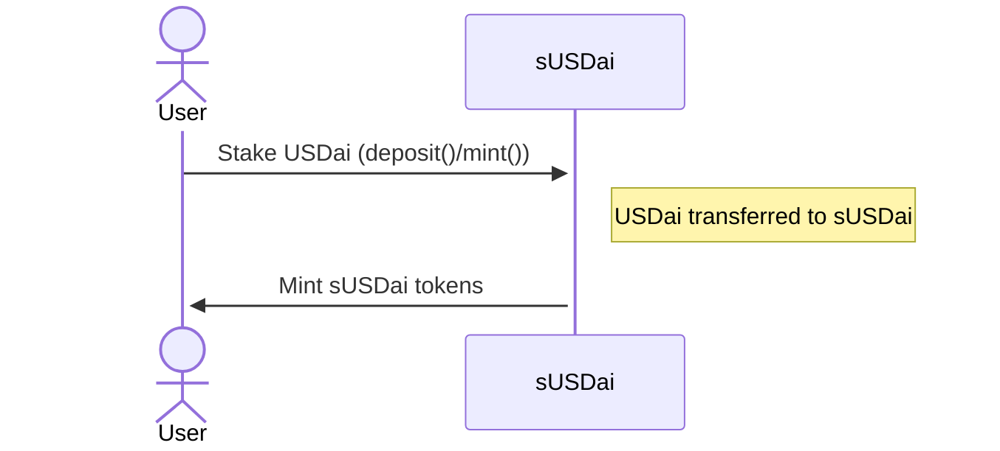
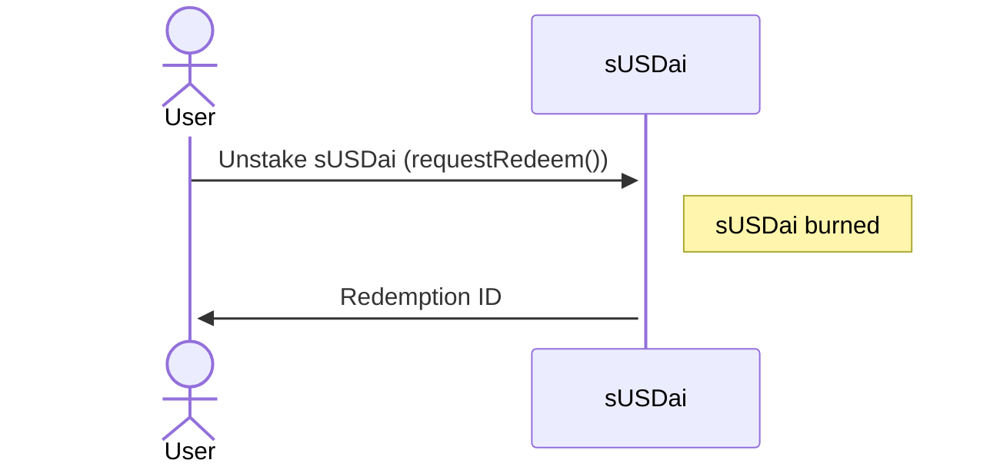
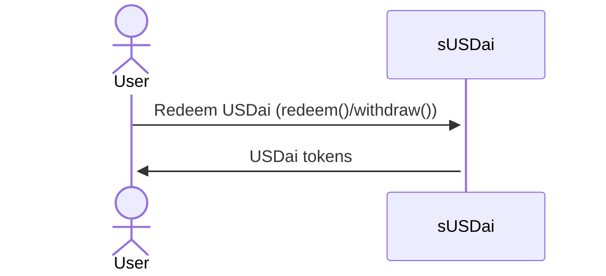
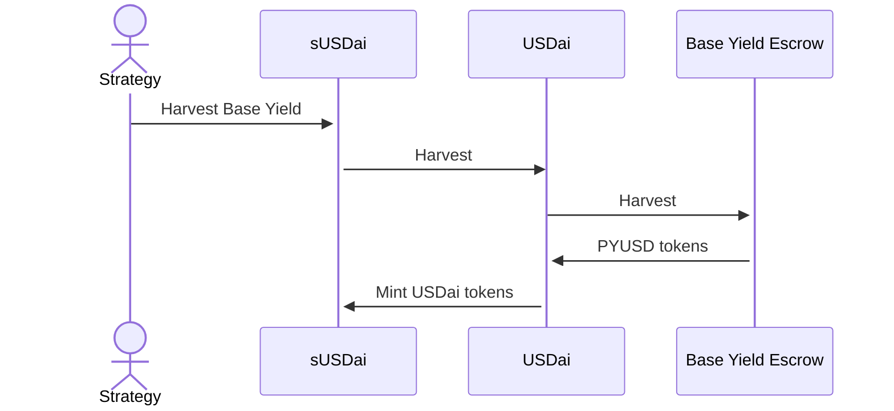
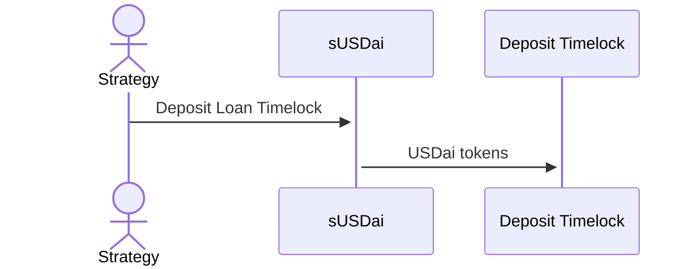
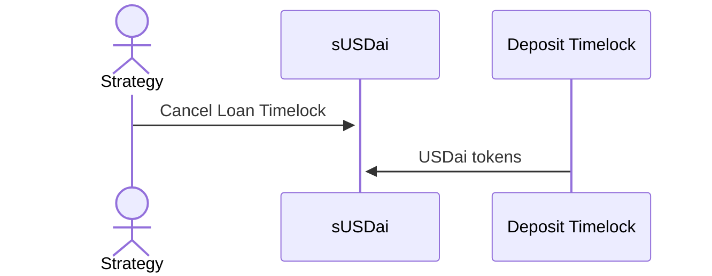
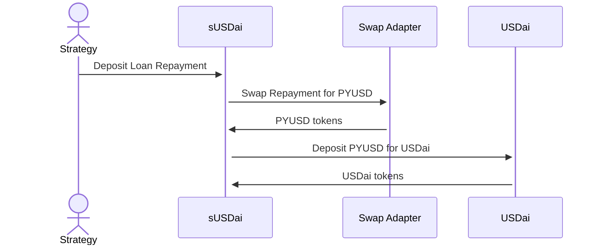

# USDai/sUSDai Design

## USDai

USDai is an
[$PYUSD](https://www.paypal.com/us/digital-wallet/manage-money/crypto/pyusd)-backed
stablecoin. It is primarily used as the on and off ramp to Staked USDai
(sUSDai), but may offer other incentives in the future.

### Minting

Users can mint USDai by depositing a supported stablecoin (e.g. USDC, USDT),
which is swapped internally for PYUSD.

```solidity
/**
 * @notice Deposit
 * @param depositToken Deposit token
 * @param depositAmount Deposit amount
 * @param usdaiAmountMinimum Minimum USDai amount
 * @param recipient Recipient
 * @param data Data (for swap adapter)
 * @return USDai amount
 */
function deposit(
    address depositToken,
    uint256 depositAmount,
    uint256 usdaiAmountMinimum,
    address recipient,
    bytes calldata data
) external returns (uint256);
```



### Burning

Users can burn USDai and withdraw a supported stablecoin.

```solidity
/**
 * @notice Withdraw
 * @param withdrawToken Withdraw token
 * @param usdaiAmount USD amount
 * @param withdrawAmountMinimum Withdraw amount minimum
 * @param recipient Recipient
 * @param data Data (for swap adapter)
 * @return Withdraw amount
 */
function withdraw(
    address withdrawToken,
    uint256 usdaiAmount,
    uint256 withdrawAmountMinimum,
    address recipient,
    bytes calldata data
) external returns (uint256);
```



### Swap Adapters

Swap adapters are responsible for swapping in and out of PYUSD with supported
currencies. Currently, the default swap adapter is the
[`UniswapV3SwapAdapter`](../src/swapAdapters/UniswapV3SwapAdapter.sol). Swap
adapters accept optional data to help facilitate swapping. In the case of the
`UniswapV3SwapAdapter`, the optional data specifies a path for the swap router
to swap tokens that do not have a direct swap market with PYUSD.

## sUSDai

Staked USDai (sUSDai) is a yield bearing ERC4626 (ERC7540 redeem) vault token
that earns yield from USDai PYUSD emissions and
[LoanRouter](https://github.com/usdai-foundation/usdai-loan-router-contracts)
loans. USDai can be staked for sUSDai, and later redeemed back for USDai.
Unlike USDai, sUSDai is not a stablecoin, but is a free floating token,
representing shares in an assortment of targeted lending positions and
unallocated USDai.

### Staking

Users can stake USDai to receive sUSDai at the current deposit share price.
Staking is a synchronous ERC4626 deposit operation.

```solidity
function deposit(uint256 assets, address receiver) external returns (uint256 shares);
function mint(uint256 shares, address receiver) external returns (uint256 assets);
```



Overloads for `deposit()` and `mint()` are provided with slippage protections
for EOAs.

### Unstaking

Users can unstake sUSDai to receive USDai at the current redemption share
price. Unstaking is an asynchronous ERC7540 redeem operation. Redemptions are
are processed at the end of a fixed time window (e.g. 30 days).

```solidity
function requestRedeem(uint256 shares, address controller, address owner) external returns (uint256 requestId);
function redeem(uint256 shares, address receiver, address owner) external returns (uint256 assets);
function withdraw(uint256 assets, address receiver, address owner) external returns (uint256 shares);
```





### Position Managers

The underlying asset held by the sUSDai vault is USDai, which is harvested for
yield and deployed into loans with the help of position managers.

The `STRATEGY_ADMIN_ROLE` is required to interact with position managers.
Currently, these operations are scheduled offchain and executed by a multisig,
but in the future will be governance-driven.

The [`BasePositionManager`](../src/positionManagers/BasePositionManager.sol) is
responsible for harvesting base yield for the PYUSD held in the USDai contract.
PYUSD base yield can be harvested with the `harvestBaseYield()` API:

```solidity
/**
 * @notice Harvest base yield
 * @return Harvested USDai amount
 * @return Admin fee
 */
function harvestBaseYield() external returns (uint256, uint256);
```



The [`LoanRouterPositionManager`](../src/positionManagers/LoanRouterPositionManager.sol)
is responsible for deploying funds for loans and depositing loan repayments.

Loans are funded from deposits in the Deposit Timelock, which are released when
a borrower executes a loan. Funds can be deposited into the Deposit Timelock
for specific, predetermined loan terms with the `depositLoanTimelock()` API:

```solidity
/**
 * @notice Deposit loan timelock
 * @param loanTermsHash Loan terms hash
 * @param usdaiAmount USDai amount
 * @param expiration Expiration timestamp
 */
function depositLoanTimelock(bytes32 loanTermsHash, uint256 usdaiAmount, uint64 expiration) external;
```



In case of loan terms changes or expiration, funds can be withdrawn from the
Deposit Timelock with the `cancelLoanTimelock()` API:

```solidity
/**
 * @notice Cancel loan timelock
 * @param loanTermsHash Loan terms hash
 */
function cancelLoanTimelock(
    bytes32 loanTermsHash
) external;
```



Principal and interest payments are automatically transferred to the sUSDai
contract when a borrower makes a loan repayment. These repayments are then
redeposited as USDai in the sUSDai contract with the `depositLoanRepayment()`
API:

```solidity
/**
 * @notice Deposit loan repayment
 * @param currencyToken Currency token
 * @param depositAmount Deposit amount
 * @param usdaiAmountMinimum Minimum USDai amount
 * @param data Swap data
 */
function depositLoanRepayment(
    address currencyToken,
    uint256 depositAmount,
    uint256 usdaiAmountMinimum,
    bytes calldata data
) external;
```



### Share Pricing

The net asset value of sUSDai is the combined value of unallocated USDai and
its loan positions. Loan positions are valued conservatively with the remaining
balance of the loan, or optimistically with the remaining balance of the loan
plus the interest accrued since last repayment.

The deposit share price is computed from the optimistic net asset value, while
the redemption share price is computed from the conservative net asset value.
In general, the deposit share price is greater than or equal to the redemption
share price. If there are no active loans, they are equal.

Since the net asset value is denominated in USDai (backed by PYUSD), a price
oracle is needed to convert the loan position value, denominated in the loan
currency (e.g. USDC), back to USDai. [`IPriceOracle`](../src/interfaces/IPriceOracle.sol) provides this interface.
The current implementation, [`ChainlinkPriceOracle`](../src/oracles/ChainlinkPriceOracle.sol), uses Chainlink to price the
exchange rate of the loan currencies.

```solidity
/**
 * @notice Check if token is supported
 * @param token Token
 * @return True if token is supported, false otherwise
 */
function supportedToken(
    address token
) external view returns (bool);

/**
 * @notice Get price of token in terms of USDai
 * @param token Token
 */
function price(
    address token
) external view returns (uint256);
```

### Redemption Queue

Redemptions in sUSDai are managed with a FIFO queue, which are collected
throughout and processed at the end of fixed time windows (e.g. 30 days). In
the future, the redemption queue will implement a built-in auction to bid on
queue position.

Redemptions are serviced periodically by the `STRATEGY_ADMIN_ROLE`. When
sufficient USDai is available, the strategy calls `serviceRedemptions()` to
process redemptions in the queue:

```solidity
/**
 * @notice Service pending redemption requests
 * @param shares Shares to process
 * @return Amount processed
 */
function serviceRedemptions(
    uint256 shares
) external returns (uint256);
```

## Omnichain Support

USDai and sUSDai support `burn()`/`mint()`-style omnichain token transfers.
This interface requires the `BRIDGE_ADMIN_ROLE`, which is granted to the token
messaging contract.

Support for LayerZero is available with [`OAdapter`](../src/omnichain/OAdapter.sol), which implements
the messaging endpoint, and the [`OToken`](../src/omnichain/OToken.sol), which implements an ERC20 of
the bridged representation.
